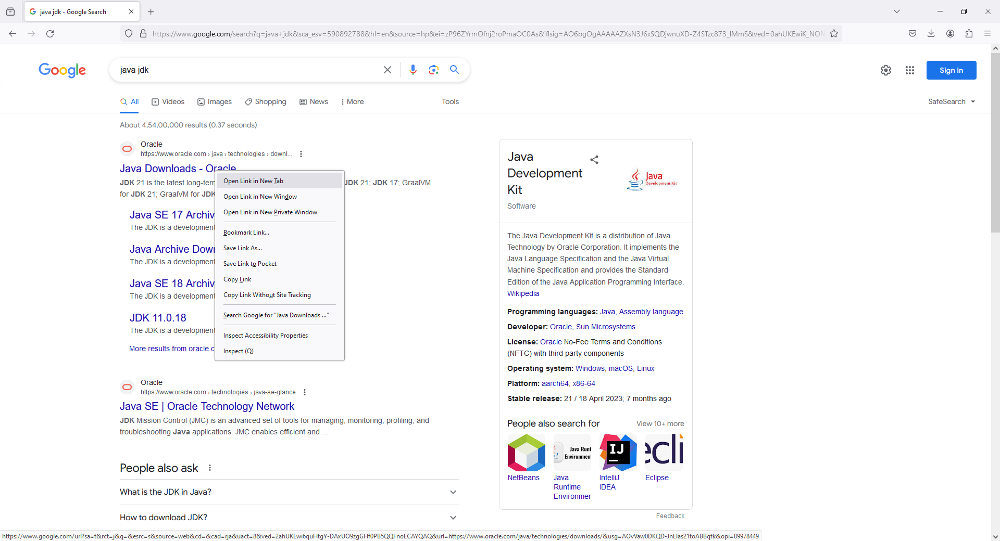

# 3 - Download and Install Java JDK





22. **Check Java Version**

```
java --version
```

```
java 21.0.1 2023-10-17 LTS
Java(TM) SE Runtime Environment (build 21.0.1+12-LTS-29)
Java HotSpot(TM) 64-Bit Server VM (build 21.0.1+12-LTS-29, mixed mode, sharing)
```

```
javac --version
```

```
javac 21.0.1
```